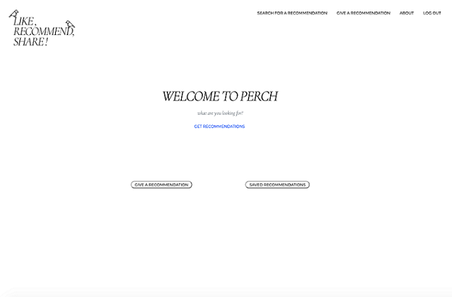

<h1 align=center>Perch Review</h1>

- Link to GitHub repository: https://github.com/ktinj/Final-Project
- Link to deployed site: https://perch-review.herokuapp.com/

## Description
- WONDERFUL DESCRIPTION HERE

## Table of Contents
- [Description](#Description)
- [Installation](#Installation)
- [Usage](#Usage)
- [License](#License)
- [FutureDevelopment](#FutureDevelopment)
- [Contributors](#Contributors)
- [Testing](#Testing)
- [Questions](#Questions)

## Installation
This project requires no installation.

## Usage
To use this project, a user must navigate to the deployed URL. 

## License

This project is covered by the ISC license.

## Future Development
- GREAT FUTURE THINGS

## Contributors
- Adriana Soler
- Kentaro Kinoshita
- Kristen Jacobsen
- Talia Zisman

## Testing
This project can be tested by following the usage instructions.

## Questions
Please contact the contributors of this application with any questions.
- Adriana Soler
    - Email: asoler000@gmail.com
    - GitHub: [asoler000](http://github.com/asoler000)
- Kentaro Kinoshita
    - Email: mixmix0321@gmail.com
    - GitHub: [KentaroKinoShita](http://github.com/KentaroKinoShita)
- Kristin Jacobsen
    - Email: kristinjacobsenn@gmail.com
    - GitHub: [ktinj](http://github.com/ktinj)
- Talia Zisman
    - Email: tzcodes101@gmail.com
    - GitHub: [tzcodes101](http://github.com/tzcodes101)